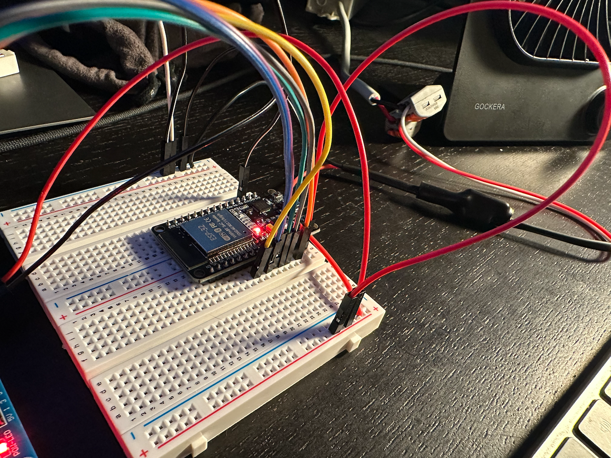

# ESP32 Relay Board Demo

A minimal PlatformIO/Arduino demo that drives a relay board from an ESP32 dev board. Sixteen relays are sequenced round-robin using non-blocking timing so the main loop never stalls.

## Hardware

- ESP32 dev board (DOIT ESP32 DevKit V1, 38-pin)
- 16-channel relay board (active-low)
- Jumper wires connecting the relay inputs to the GPIO pins below

### Pin Mapping

| Relay | GPIO | Notes |
|-------|------|-------|
| 1     | 4    | |
| 2     | 13   | |
| 3     | 14   | |
| 4     | 15   | Strapping pin — must be HIGH at boot; safe for active-low relay boards |
| 5     | 16   | |
| 6     | 17   | |
| 7     | 18   | |
| 8     | 19   | |
| 9     | 21   | |
| 10    | 22   | |
| 11    | 23   | |
| 12    | 25   | |
| 13    | 26   | |
| 14    | 27   | |
| 15    | 32   | |
| 16    | 33   | |

The on-board LED (GPIO 2) is used as a program status indicator.

### GPIO Constraints on the ESP32 DevKit V1

These GPIOs are unavailable and must not be used for relay outputs:

| GPIO(s) | Reason |
|---------|--------|
| 0       | Boot strapping pin — LOW at boot triggers download mode |
| 1, 3    | UART0 TX/RX — used by the serial monitor |
| 2       | On-board LED |
| 6–11    | Internal flash SPI bus — never use as GPIO |
| 12      | Strapping pin — sets flash voltage; must be LOW at boot |
| 5       | Strapping pin — goes LOW at boot, would briefly energise an active-low relay |
| 34, 35, 36, 39 | Input-only — no output capability |

## How It Works

The `loop()` function runs continuously without any blocking `delay()` calls. Two independent timers are driven by `millis()` comparisons:

| Timer | Rate | Purpose |
|-------|------|---------|
| Status LED | 500 ms | Blinks the on-board LED to confirm the program is running |
| Relay sequencer | 100 ms | Steps through each relay one at a time, deactivating the previous and activating the next |

Because both timers are independent, the LED blinks at its own 500 ms cadence while the relay sequence advances five times faster at 100 ms — they are not coupled or synchronised to each other.

Relays are active-low: `LOW` energises the coil, `HIGH` releases it. All relays are initialised to `HIGH` (off) in `setup()`.

## Building & Flashing

This project uses [PlatformIO](https://platformio.org/).

```bash
# Build
pio run

# Upload
pio run --target upload

# Open serial monitor (115200 baud)
pio device monitor
```

## Photos / Video

[](https://github.com/ehellyer/esp32_relayboard/blob/master/PhotosVideos/SequenceRelays.mov)
